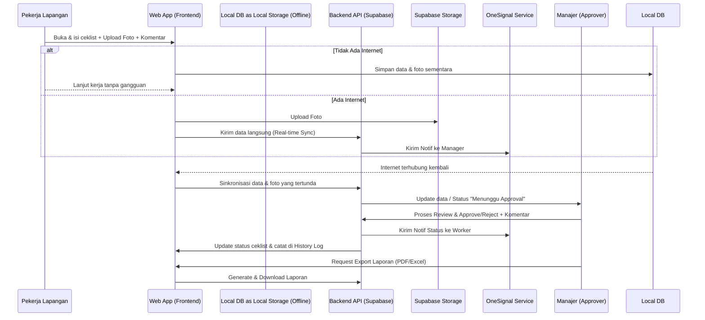
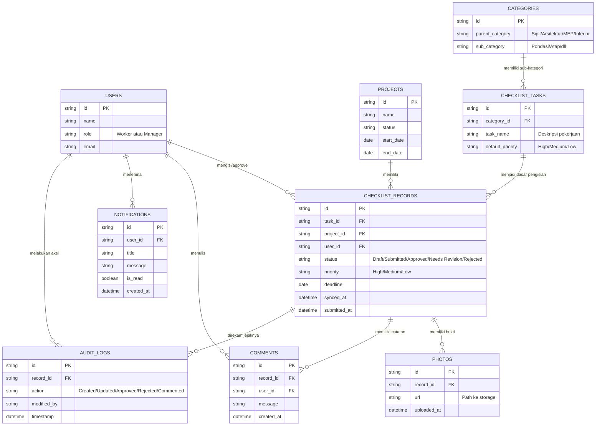

# PRD — Project Requirements Document

## 1. Overview
Dalam proyek konstruksi, proses inspeksi, pengawasan kualitas (QA/QC), dan pelaporan seringkali masih dilakukan secara manual menggunakan kertas atau spreadsheet yang terpisah. Hal ini menyebabkan risiko data hilang, miskomunikasi, lambatnya persetujuan (approval), serta kurangnya bukti visual yang memadai. 

Aplikasi **Web App Ceklist Konstruksi** ini bertujuan untuk mendigitalisasi proses inspeksi lapangan khusus untuk tim kontraktor skala kecil (kurang dari 10 pengguna). Aplikasi ini dirancang agar dapat merampingkan alur kerja, memungkinkan pengisian ceklist di lapangan (bahkan tanpa sinyal internet), menyertakan bukti visual, mengelola prioritas pekerjaan, menyediakan ruang komunikasi teknis, mencatat jejak audit, dan menyajikan laporan instan. 

## 2. Requirements
- **Akses Fleksibel (Semua Perangkat):** Aplikasi harus responsif, nyaman digunakan di layar HP pekerja lapangan maupun layar laptop untuk manajer.
- **Mode Offline (Wajib):** Pekerja sering berada di area proyek (seperti basement) tanpa sinyal. Aplikasi harus bisa menyimpan data secara lokal dan otomatis melakukan sinkronisasi saat terhubung ke internet.
- **Bukti Visual (Foto):** Setiap item ceklist harus mendukung lampiran foto sebagai bukti pekerjaan selesai atau catatan kerusakan.
- **Sistem Notifikasi:** Manajer harus mendapat notifikasi saat ada submit baru, dan Pekerja harus mendapat notifikasi jika pekerjaan direvisi.
- **Sistem Pengguna Terbatas:** Dioptimalkan untuk tim kecil (<10 orang), dengan pembagian peran sederhana (misalnya: *Field Worker* / Pengisi Ceklist dan *Manager* / Pemberi Approval).
- **Manajemen Prioritas & Waktu:** Setiap tugas harus memiliki label prioritas dan target deadline untuk memudahkan manajemen waktu.
- **Komunikasi Terpusat:** Harus ada kolom komentar pada setiap item untuk diskusi teknis tanpa keluar aplikasi.
- **Jejak Audit (Audit Trail):** Sistem harus mencatat secara otomatis siapa yang melakukan perubahan dan kapan untuk akuntabilitas.
- **Kemudahan Laporan:** Harus bisa mengekspor data yang sudah di-approve menjadi format standar (PDF dan Excel) untuk diserahkan ke klien atau pemilik proyek.

## 3. Core Features
- **Manajemen Ceklist Terstruktur:** Ceklist dibagi menjadi 4 kategori utama beserta sub-kategorinya secara mendetail:
  - **Sipil:** Pondasi, Struktur Beton, Pekerjaan Tanah, Atap.
  - **Arsitektur:** Pasangan Bata & Plesteran, Pemasangan Pintu & Jendela, Pengecatan, Pemasangan Keramik/Lantai.
  - **MEP (Mechanical, Electrical, Plumbing):** Instalasi Kabel Listrik, Pipa Air Bersih & Kotor, Sistem HVAC (AC), Panel Listrik.
  - **Interior:** Pemasangan Plafon, Pekerjaan Kayu (Custom Furniture), Pemasangan Wallpaper, Pemasangan Lampu (Lighting).
- **Lampiran Foto & Bukti Visual:** Pengguna dapat mengunggah satu atau lebih foto langsung dari kamera perangkat pada setiap item ceklist. Foto berfungsi sebagai bukti fisik sebelum approval diberikan.
- **Sinkronisasi Real-time & Mode Offline:** Pengguna dapat mengisi ceklist kapan saja. Jika offline, data disimpan di perangkat. Jika online, data langsung diperbarui di server dan terlihat oleh semua tim.
- **Approval Flow & Re-work Loop:** Alur persetujuan pekerjaan secara berjenjang. 
  - Pekerja lapangan mensubmit (Mengajukan) -> Status: *Submitted*.
  - Supervisor mereview -> Approve (Status: *Approved*) atau Reject (Status: *Needs Revision*).
  - Jika *Needs Revision*, Pekerja harus memperbaiki, mengunggah foto baru, dan submit ulang.
- **Prioritas & Deadline:** Setiap item ceklist memiliki label prioritas (High, Medium, Low) dan target tanggal penyelesaian untuk membantu manajer memantau Critical Path proyek.
- **Comment Box (Kolom Komentar):** Fitur komunikasi konteks pada setiap item ceklist. Manajer dapat memberikan instruksi perbaikan spesifik saat menolak, dan Pekerja dapat memberikan catatan kendala saat mengisi.
- **History Log (Audit Trail):** Rekam jejak aktivitas secara detail (siapa yang mencentang, mengubah, menyetujui, atau menolak, lengkap dengan waktu dan tanggal) untuk transparansi dan bukti tanggung jawab.
- **Dashboard & Export:** Ringkasan visual (grafik) progres pekerjaan proyek, lengkap dengan tombol untuk mengunduh laporan ke PDF (dengan tanda tangan digital) atau Excel.

## 4. User Flow
1. **Login & Pilih Proyek:** Pengguna masuk ke aplikasi dan memilih proyek yang sedang dikerjakan.
2. **Akses Ceklist (Offline/Online):** Pengguna memilih Kategori (misal: Arsitektur) lalu Sub-kategori (misal: Pengecatan). Sistem menampilkan prioritas dan deadline tugas.
3. **Pengisian, Foto & Komentar:** Pengguna mencentang item pekerjaan. Pengguna wajib/optional mengunggah foto bukti pekerjaan. Jika ada kendala, pengguna meninggalkan pesan di *Comment Box*.
4. **Submit Pekerjaan:** Setelah selesai, pengguna menekan "Submit". 
   - Jika offline, data masuk ke antrean *Offline Sync*.
   - Jika online, status berubah menjadi *Submitted* dan Manajer menerima Notifikasi.
5. **Review & Approval Manager:** 
   - Manajer menerima notifikasi, mengecek ceklist dan foto.
   - **Jika Ok:** Manajer menekan "Approve". Pekerja menerima notifikasi selesai.
   - **Jika Tidak Ok:** Manajer menekan "Reject" dan **wajib mengisi Komentar** menjelaskan alasan penolakan. Status berubah menjadi *Needs Revision*. Pekerja menerima notifikasi revisi.
6. **Proses Revisi (Jika Ditolak):** Pekerja membuka item berstatus *Needs Revision*, membaca komentar manajer, melakukan perbaikan, mengunggah foto baru, dan menekan "Submit Ulang".
7. **Pembuatan Laporan:** Manajer membuka Dashboard untuk melihat progres keseluruhan (% selesai per kategori). Manajer mengekspor hasil ceklist periode tertentu ke dalam bentuk PDF/Excel untuk dilaporkan ke klien.

## 5. Architecture
Aplikasi ini menggunakan arsitektur *Client-Server* modern yang mendukung *Progressive Web App (PWA)* agar dapat berjalan secara offline. Sistem juga mengintegrasikan layanan penyimpanan gambar dan notifikasi.

## 6. Database Schema
Berikut adalah tabel utama yang dibutuhkan untuk menyimpan seluruh data aplikasi menggunakan database relasional (PostgreSQL/Supabase):

- **Users:** Menyimpan data pekerja dan manajer.
- **Projects:** Menyimpan data proyek konstruksi yang sedang berjalan.
- **Categories:** Menyimpan struktur 4 kategori utama dan sub-kategorinya.
- **ChecklistTasks:** Pekerjaan atau tugas spesifik per sub-kategori (termasuk prioritas default).
- **ChecklistRecords:** Catatan pengisian/hasil dari lapangan (termasuk status, deadline, prioritas).
- **Photos:** Menyimpan URL foto bukti untuk setiap record.
- **Comments:** Catatan/pesan untuk komunikasi per item ceklist.
- **Notifications:** Menyimpan antrian notifikasi untuk pengguna.
- **AuditLogs (History Log):** Rekam jejak setiap perubahan pada sistem.

## 7. Tech Stack
Rekomendasi teknologi ini dipilih berdasarkan kriteria **Tier Gratis (Free Tier)** terbaik untuk tim kecil (<10 orang), memastikan biaya operasional nol rupiah namun tetap performan dan modern:

- **Frontend & Backend (Full-stack Framework):** **Next.js (App Router)** — Memudahkan pembuatan antarmuka responsif sekaligus mengelola API di satu tempat.
- **Hosting:** **Vercel** — Mendukung Next.js secara native dengan **Free Tier** yang cukup untuk proyek skala kecil.
- **Database, Auth & Storage:** **Supabase** — Solusi all-in-one berbasis PostgreSQL.
  - *Database:* PostgreSQL (Free Tier 500MB) — Cukup untuk data tekstual ribuan ceklist.
  - *Authentication:* Supabase Auth — Sistem login aman dan terintegrasi.
  - *Image Storage:* Supabase Storage (Free Tier 1GB) — Untuk menyimpan foto bukti lapangan dengan aman dan mudah diakses.
- **Styling & UI Components:** **Tailwind CSS** dan **shadcn/ui** — Untuk tampilan antarmuka yang modern, rapi, dan cepat dibuat tanpa mendesain dari nol.
- **Fitur Khusus Offline (Front-end):** **IndexedDB** & **Service Worker (PWA)** — Untuk mendownload halaman agar bisa dibuka tanpa sinyal dan menyimpan data ceklist secara lokal.
- **Notification Service:** **OneSignal** — **Free Tier** (hingga 10.000 subscriber) untuk mengirimkan notifikasi real-time (Push Notification) ke perangkat pengguna tanpa konfigurasi rumit.
- **Export Tools:** 
  - *PDF:* `jsPDF` / `Puppeteer` (untuk mengubah halaman langsung ke PDF).
  - *Excel:* `SheetJS` / `XLSX` (untuk merapikan data log menjadi format spreadsheet Excel).

## 8. Design Guidelines
Panduan desain ini memastikan aplikasi dapat digunakan dengan nyaman di lingkungan konstruksi yang menantang.

- **UI Style:** 
  - **Clean & Professional:** Tampilan minimalis untuk mengurangi kebisingan visual.
  - **High Contrast:** Kontras warna tinggi untuk memastikan keterbacaan di bawah sinar matahari langsung (outdoor usage).
- **Component Library:** 
  - Menggunakan **shadcn/ui** yang dibangun di atas **Tailwind CSS** untuk konsistensi dan kecepatan pengembangan.
- **Mobile First:** 
  - Prioritas pada penggunaan satu tangan (*one-handed use*).
  - Tombol aksi utama (Submit, Approve) berukuran besar dan mudah ditekan.
  - Navigasi utama diletakkan di bagian bawah (*Bottom Navigation Bar*) untuk kemudahan akses di HP.
- **Color Palette:**
  - **Primary:** Dark Slate (Untuk teks dan elemen utama).
  - **Accent:** Safety Orange (Untuk tombol aksi penting dan perhatian).
  - **Status Success:** Green (Untuk status Approved/Selesai).
  - **Status Error:** Red (Untuk status Rejected/Needs Revision).

## 9. Development Process Flow
Alur pengembangan perangkat lunak yang terstruktur untuk memastikan kualitas dan ketepatan waktu.

1. **Planning:**
   - Finalisasi skema Database (Supabase).
   - Penentuan kriteria dan detail item ceklist per kategori.
   - Penetapan role user dan hak akses.
2. **Designing:**
   - Pembuatan Wireframe Low-Fidelity untuk alur utama.
   - Pembuatan High-Fidelity Mockup menggunakan Figma sesuai Design Guidelines.
   - Review desain dengan stakeholder.
3. **Frontend Dev:**
   - Setup proyek Next.js dan konfigurasi Tailwind/shadcn.
   - Pengembangan UI Components (Form, List, Dashboard).
   - Implementasi PWA (Service Worker & Manifest) untuk mode offline.
4. **Backend Dev:**
   - Setup Supabase Project (Auth, Database Tables, Storage Buckets).
   - Konfigurasi Row Level Security (RLS) untuk keamanan data.
   - Setup Edge Functions untuk Trigger Notifikasi.
5. **Integration:**
   - Menghubungkan Frontend dengan Supabase Client.
   - Integrasi OneSignal SDK untuk Push Notifications.
   - Implementasi logika sinkronisasi Offline-Online (IndexedDB).
6. **Testing:**
   - Uji coba Mode Offline (putus koneksi internet saat mengisi).
   - Uji coba Upload Foto (kompresi dan kecepatan).
   - Cross-browser testing (Chrome, Safari, Mobile View).
   - User Acceptance Testing (UAT) dengan tim kecil.

## 10. Implementation Roadmap
Rencana implementasi selama 4 minggu untuk menghasilkan MVP (Minimum Viable Product) yang siap pakai.

- **Minggu 1: Foundation & Basic UI**
  - Setup lingkungan development (Next.js, Vercel, Supabase).
  - Implementasi Database Schema & Authentication.
  - Pembuatan UI Dasar (Login, Dashboard, List Kategori Sipil & Arsitektur).
  
- **Minggu 2: Core Features & Offline**
  - Pengembangan fitur isi Ceklist & Upload Foto.
  - Implementasi Mode Offline (IndexedDB & Sync Logic).
  - Integrasi Storage Supabase untuk foto.

- **Minggu 3: Workflow & Communication**
  - Implementasi Approval Flow (Submit, Approve, Reject).
  - Fitur Re-work Loop & Comment Box.
  - Integrasi Notifikasi Push (OneSignal) untuk status update.

- **Minggu 4: Reporting & Deployment**
  - Pengembangan Dashboard Progres & Grafik.
  - Fitur Export Laporan (PDF & Excel).
  - Final Testing, Bug Fixing, dan Deployment Produksi ke Vercel.